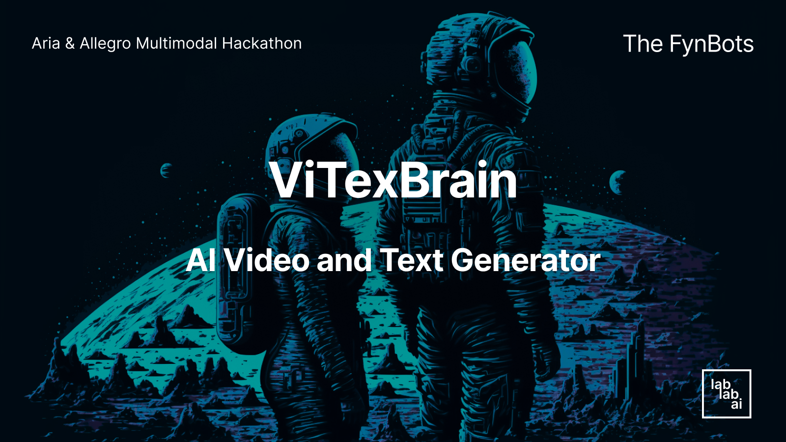
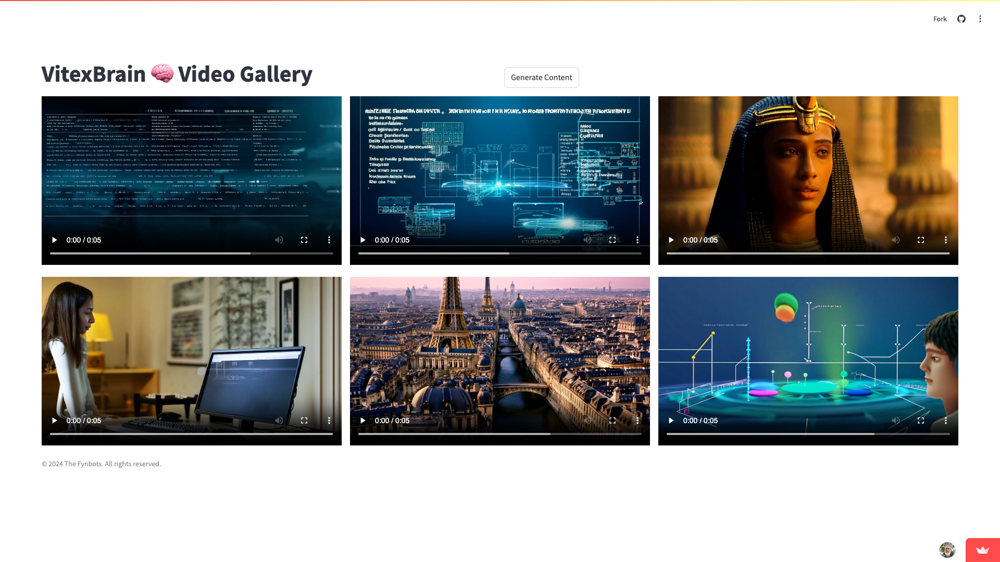
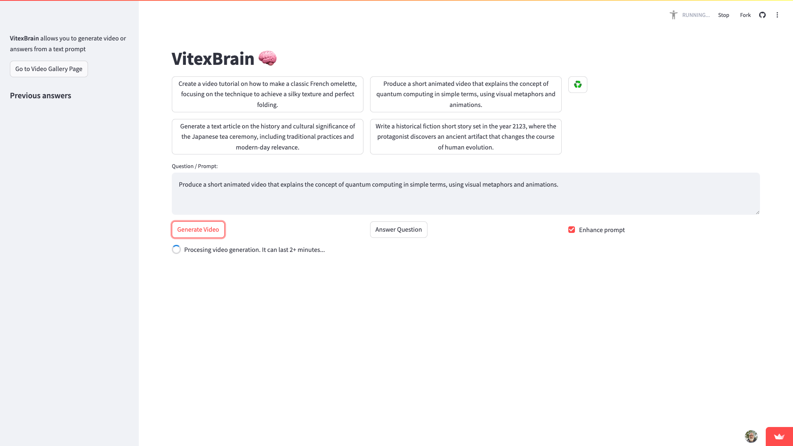
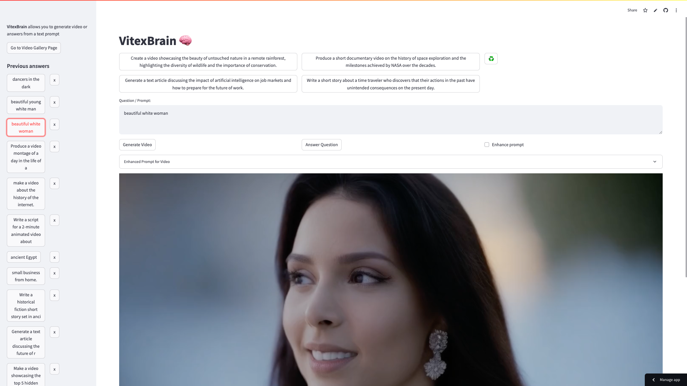
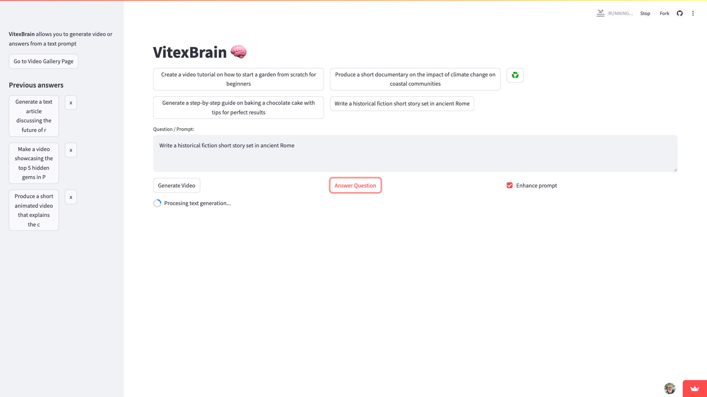
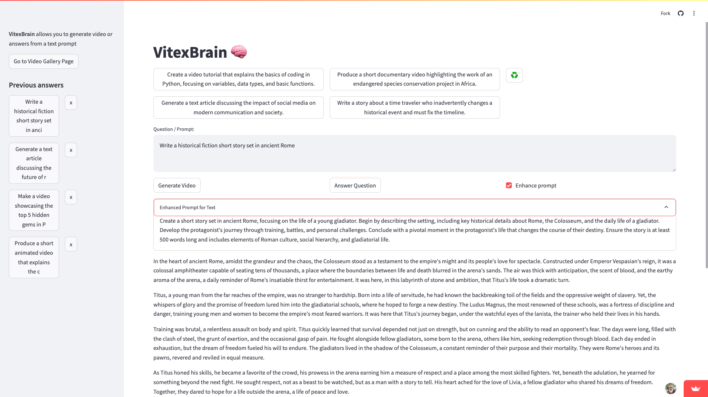
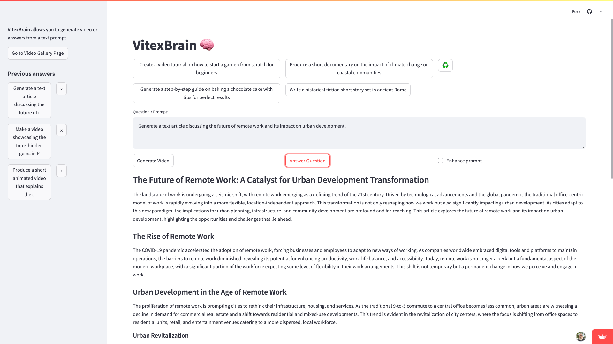
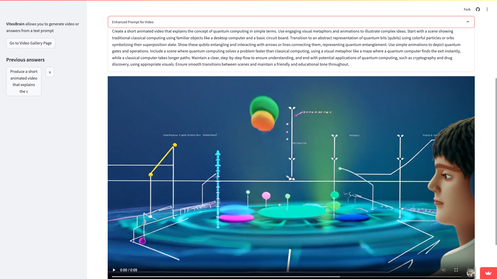
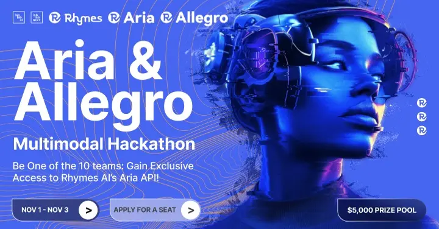

# ViTexBrain

AI Video and Text Generator using Rhymes' Aria and Allegro models.



## Introduction

[VitexBrain](https://vitexbrain.streamlit.app/) is an innovative application that leverages the cutting-edge AI models [Aria](https://rhymes.ai/blog-details/aria-first-open-multimodal-native-moe-model) and [Allegro](https://rhymes.ai/blog-details/allegro-advanced-video-generation-model) by [Rhymes.ai](https://www.rhymes.ai/) to generate high-quality answers and videos from text prompts. This tool is designed to empower developers, researchers, and businesses by providing a seamless and efficient way to create multimodal content. Whether you need to generate videos from scratch or enhance existing content, VitexBrain is your go-to solution for AI-driven creativity.

## Key Features

* AI-Powered guidance using Aria and Allegro models.
* Seamless Integration: processes text and videos with high-quality results.
* Video gallery to show the videos generated.
* Video generation follow-up just in case the video generation fails.
* Prompt enhancement support.
* Prompts suggestions generated from AI on each form submission and a button to refresh them.
* MongoDB and JSON databases support.

## Technology Used

### Aria
* Is the flagship Mixture-of-Experts model by Rhymes AI, designed for handling multimodal inputs (text, images, video), is open-source and emphasizes efficiency and high performance. 
* It has Efficient Parameter Utilization: because it activates only 3.9 billion of its 25.3 billion parameters during inference, making it one of the fastest multimodal AI systems.
* It processes diverse data formats with a 64K-long multimodal context window, offering comprehensive insights, including the ability to caption 256-frame videos in just 10 seconds.
* Links: [Hugging Face](https://huggingface.co/rhymes-ai/Aria) | [GitHub](https://github.com/rhymes-ai/Aria) | [Blog](https://rhymes.ai/blog-details/aria-first-open-multimodal-native-moe-model) | [Paper](https://arxiv.org/pdf/2410.05993)

### Allegro
* It’s Rhymes AI's text-to-video model that transforms text into high-quality videos, optimized for creative industries.
* With a 3B parameter model size, Allegro efficiently generates 720p resolution video clips in minutes, facilitating rapid content creation for content creators, marketers, and AI researchers.
* Links: [Hugging Face](https://huggingface.co/rhymes-ai/Allegro) | [GitHub](https://github.com/rhymes-ai/Allegro) | [Blog](https://rhymes.ai/blog-details/allegro-advanced-video-generation-model) | [Paper](https://arxiv.org/abs/2410.15458) | [Video Gallery](https://rhymes.ai/allegro_gallery)

### Programming Languages and Frameworks

* [Python](https://www.python.org)
* [Streamlit](https://streamlit.io)

## Getting Started

### Prerequisites

- [Python](https://www.python.org/downloads/) 3.10 or higher
- [Git](https://www.atlassian.com/git/tutorials/install-git)
- Make: [Mac](https://formulae.brew.sh/formula/make) | [Windows](https://stackoverflow.com/questions/32127524/how-to-install-and-use-make-in-windows)

### Installation

Clone the repository:
```bash
git clone https://github.com/tomkat-cr/vitexbrain.git
```

Navigate to the project directory:

```bash
cd vitexbrain
```

### Create the .env file

Create a `.env` file in the root directory of the project:

```bash
# You can copy the .env.example file in the root directory of the project
cp .env.example .env
```

The `.env` file should have the following content:

```bash
PYTHON_VERSION=3.10
#
# LLM parameters
TEXT_TO_VIDEO_PROVIDER=rhymes
LLM_PROVIDER=rhymes
#
# RHYMES parameters
RHYMES_ARIA_API_KEY=rhymes_aria_api_key
RHYMES_ALLEGRO_API_KEY=rhymes_allegro_api_key
#
# Database parameters
DB_TYPE=json
# DB_TYPE=mongodb
#
# JSON database parameters
JSON_DB_PATH=./db/conversations.json
#
# MongoDB database parameters
# MONGODB_URI=mongodb+srv://<user>:<password>@<cluster>.mongodb.net
# MONGODB_DB_NAME=vitexbrain
# MONGODB_COLLECTION_NAME=conversations
```

Replace `YOUR_RHYMES_ARIA_API_KEY`, and `YOUR_RHYMES_ALLEGRO_API_KEY` with your actual Rhymes Aria API key, and Rhymes Allegro API key, respectively.

To use a MongoDB database, comment out `DB_TYPE=json`, uncomment `# DB_TYPE=mongodb`, and replace `YOUR_MONGODB_URI`, `YOUR_MONGODB_DB_NAME`, and `YOUR_MONGODB_COLLECTION_NAME` with your actual MongoDB URI, database name, and collection name, respectively.

### Run the Application

```bash
# With Make
make run
```

```bash
# Without Make
sh scripts/run_app.sh run
```

## Usage

Go to your favorite Browser and open the URL provided by the application.

* Locally:<BR/>
  [http://localhost:8501](http://localhost:8501)

* Official App:<BR/>
  [https://vitexbrain.streamlit.app/](https://vitexbrain.streamlit.app/)

### Text-to-Video Generation

Enter your text prompt in the provided text box or select one of the suggested prompts.
Click the `Generate Video` button.
Sit back and watch as VitexBrain transforms your text into a high-quality video.

After 2+ minutes, the video will appear in the video container.

All videos are available in the side menu.

### Text-to-Text Generation

Enter your text prompt in the provided text box or select one of the suggested prompts.

Click the `Answer Question` button.

The answer will appear in the text container.

All questions and answers are available in the side menu.

### Notes

- The Prompt Suggestions under the title are generated from AI on each form submission and there's a Recycle button to refresh them. It always shows 2 suggestions for text generation and 2 suggestions for video generation.
- The conversations are stored in a JSON file localted in the `db` folder.
- Each entry in the side menu has an `x` button to delete it.

## Screenshots
















## Context

This project was developed as part of the [Aria & Allegro Multimodal Hackathon](https://lablab.ai/event/aria-multimodal-hackathon) organized by [Lablab.ai](https://lablab.ai) and happened on November 1st to 4rd, 2024.



- Project submission page: [VitexBrain](https://lablab.ai/event/aria-multimodal-hackathon/the-fynbots/vitexbrain)

- Presentation video: [Aria Allegro Multimodal Hackathon - VITEXBRAIN App Video Presentation](https://youtu.be/F3TwQxO0NcY)

- Team: [The FynBots](https://lablab.ai/event/aria-multimodal-hackathon/the-fynbots)

## Contributors

[Carlos J. Ramirez](https://www.linkedin.com/in/carlosjramirez/) | [Tajmir Khan](https://www.linkedin.com/in/tajmir-khan-a60a6b174/)

Please feel free to suggest improvements, report bugs, or make a contribution to the code.

## License

This project is licensed under the terms of the MIT license. See the [LICENSE](LICENSE) file for details.

## Acknowledgements

* [Rhymes.ai](https://www.rhymes.ai/) for developing the powerful [Aria](https://rhymes.ai/blog-details/aria-first-open-multimodal-native-moe-model) and [Allegro](https://rhymes.ai/blog-details/allegro-advanced-video-generation-model) models.
* [Lablab.ai](https://lablab.ai) for organizing the [Aria & Allegro Multimodal Hackathon](https://lablab.ai/event/aria-multimodal-hackathon).
* [Streamlit](https://streamlit.io/) for providing a user-friendly interface for interacting with the application.
* Open-source community for inspiring and supporting collaborative innovation.
* Users and contributors for their feedback and support.
